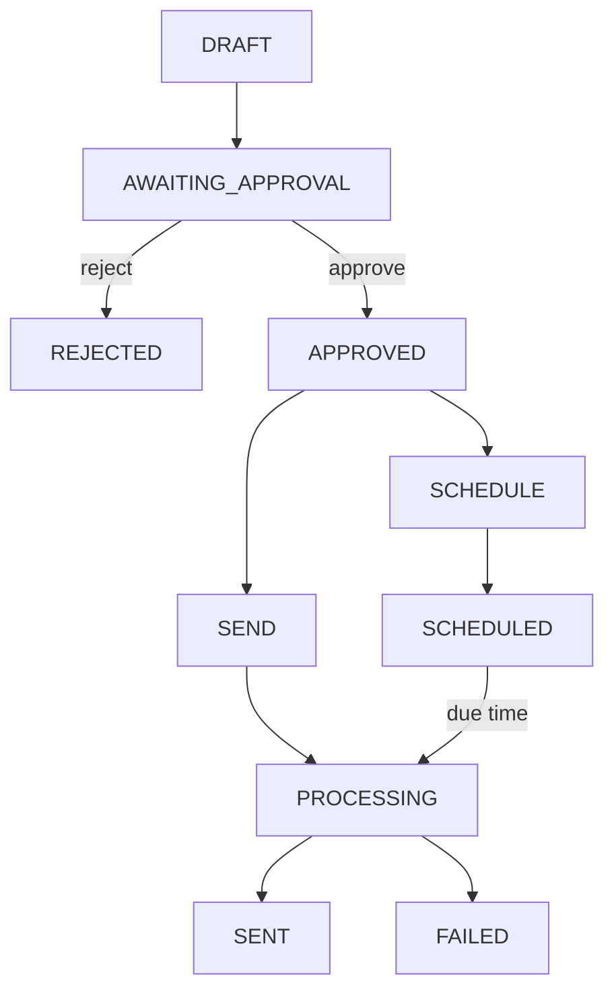
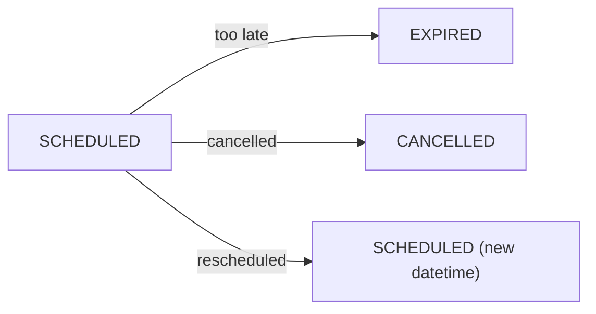

# Email Agent — State Machine

> The state machine is **more important than the LLM**.  
> This is where reliability comes from.

---

## 1. Email Job Lifecycle

Every email job follows a deterministic state machine. No state transition happens without an explicit trigger.



### Scheduled-Specific Transitions



---

## 2. State Definitions

| State | Description | Mutable? | Terminal? |
|---|---|---|---|
| `DRAFT` | Email composed by LLM, not yet shown to user | Yes | No |
| `AWAITING_APPROVAL` | Displayed to user, waiting for decision | No | No |
| `REJECTED` | User explicitly rejected the draft | No | **Yes** |
| `APPROVED` | User approved — branching to SEND or SCHEDULE | No | No |
| `SCHEDULED` | Job persisted in SQLite with exact datetime | No | No |
| `PROCESSING` | Worker has atomically claimed the job | No | No |
| `SENT` | Gmail confirmed acceptance | No | **Yes** |
| `FAILED` | Permanent failure or retries exhausted | No | **Yes** |
| `EXPIRED` | Scheduled time passed beyond grace period | No | **Yes** |
| `CANCELLED` | User cancelled a scheduled job | No | **Yes** |

---

## 3. Valid State Transitions

Only these transitions are legal. Any other transition is a **bug**.

| From | To | Trigger |
|---|---|---|
| `DRAFT` | `AWAITING_APPROVAL` | Draft displayed to user |
| `AWAITING_APPROVAL` | `REJECTED` | User selects [R]eject |
| `AWAITING_APPROVAL` | `APPROVED` | User selects [S]end or [T]imer |
| `APPROVED` | `PROCESSING` | Immediate send path |
| `APPROVED` | `SCHEDULED` | Schedule path + datetime confirmed |
| `SCHEDULED` | `PROCESSING` | Scheduler worker claims due job |
| `SCHEDULED` | `EXPIRED` | Reconciliation: past grace period |
| `SCHEDULED` | `CANCELLED` | User cancels job |
| `SCHEDULED` | `SCHEDULED` | User reschedules (new datetime) |
| `PROCESSING` | `SENT` | Gmail accepts the message |
| `PROCESSING` | `FAILED` | Permanent error or retries exhausted |
| `PROCESSING` | `SCHEDULED` | Transient failure, retry scheduled |

---

## 4. State Transition Rules

### Rule 1: Every transition must be atomic

```
UPDATE jobs
SET status = 'PROCESSING'
WHERE id = ?
AND status = 'SCHEDULED'
```

Check that exactly one row was affected. If zero rows, another worker already claimed it.

### Rule 2: Terminal states are immutable

Once a job reaches `SENT`, `FAILED`, `EXPIRED`, `REJECTED`, or `CANCELLED` — it **never** changes again.

### Rule 3: Only PROCESSING → Gmail

The Gmail API is **only** contacted when the job is in `PROCESSING` state. No other state triggers external side effects.

### Rule 4: PROCESSING is a locked state

No more than one worker may hold a job in `PROCESSING` at any time. This is enforced by atomic claiming (see [04-SCHEDULER.md](./04-SCHEDULER.md)).

---

## 5. State Machine Invariants

These must **always** be true:

1. A job in `DRAFT` has no `approved_at` timestamp.
2. A job in `AWAITING_APPROVAL` has been displayed to the user.
3. A job in `APPROVED` has a valid `approved_at` and `approved_payload_hash`.
4. A job in `SCHEDULED` has a valid `scheduled_at` timestamp and timezone.
5. A job in `PROCESSING` was atomically claimed from `SCHEDULED` or `APPROVED`.
6. A job in `SENT` has a `sent_at` timestamp and `gmail_message_id`.
7. A job in `FAILED` has `last_error` and `attempt_count`.
8. A job in `EXPIRED` was `SCHEDULED` and the grace period elapsed.
9. A job in `CANCELLED` was `SCHEDULED` and the user explicitly cancelled it.
10. A job in `REJECTED` was `AWAITING_APPROVAL` and the user chose [R]eject.

---

## 6. Race Condition: Cancel vs Process

```
User → email_cancel_scheduled(EMAIL-00021)
Scheduler → claimJob(EMAIL-00021)
```

**Resolution:** The atomic claim transition settles it.

```sql
-- Cancel attempt
UPDATE jobs SET status = 'CANCELLED'
WHERE id = 'EMAIL-00021' AND status = 'SCHEDULED'

-- Claim attempt  
UPDATE jobs SET status = 'PROCESSING'
WHERE id = 'EMAIL-00021' AND status = 'SCHEDULED'
```

Whichever executes first wins. The second gets zero rows affected, which means it loses.

The event log records both attempts for audit.

---

## 7. Event Log per State Transition

Every state change produces an event record:

```
CREATED              → Job record inserted
DRAFT_GENERATED      → LLM produced draft
APPROVAL_REQUESTED   → Draft shown to user
APPROVED             → User approved
REJECTED             → User rejected
SCHEDULE_REQUESTED   → User chose [T]imer
SCHEDULE_RESOLVED    → NL datetime → exact datetime
SCHEDULE_CONFIRMED   → User confirmed datetime (Approval #2)
SCHEDULED            → Job persisted with datetime
PROCESSING           → Worker claimed job
GMAIL_SUBMITTED      → Gmail API called
SENT                 → Gmail confirmed
FAILED               → Error occurred
EXPIRED              → Past grace period
CANCELLED            → User cancelled
RESCHEDULED          → New datetime set
```

This enables answering: **"Why did this email get sent?"** — instead of staring at `status: SENT`.
